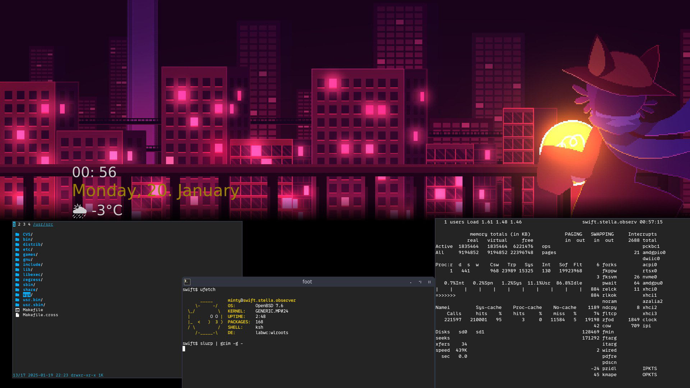

dot files / patches for my desktop setup

## screenshots

## references

[labwc](https://github.com/labwc/labwc)
[nnn](https://github.com/jarun/nnn)
[helix](https://github.com/helix-editor/helix)
[nwg-wrapper](https://github.com/nwg-piotr/nwg-wrapper)
[openbox-theme-collections](https://github.com/addy-dclxvi/openbox-theme-collections)
[ufetch](https://gitlab.com/jschx/ufetch)

[acpi kbd patch](https://marc.info/?l=openbsd-tech&m=172841287007678)
